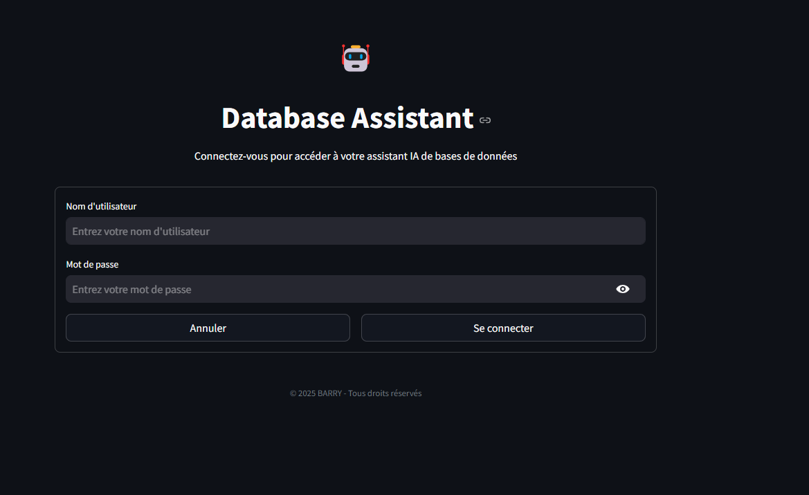

#  Database Assistant 🤖

**Database Assistant** is an interactive web application that allows you to interact with your SQL databases using natural language models (LLM). Ask questions in natural language, and the assistant will generate and execute the corresponding SQL queries to provide you with clear and precise answers.

---

## Main Features 🚀

- **Connect to multiple database types**: MySQL, PostgreSQL, SQL Server.
- **SQL Query Generation**: The assistant generates SQL queries based on your natural language questions.
- **Conversation History**: Keep a history of questions and answers for better continuity.
- **Support for multiple LLM models**: Integration with OpenAI (GPT-4, GPT-3.5) and Groq (Llama2, Mixtral).
- **Intuitive User Interface**: A modern and responsive Streamlit interface for an optimal user experience.
- **Security**: Authentication is required to access the application.

---

## Screenshot 🖼️



---

## How to Use the Application 🛠️

### 1. Log in to the Application
- Go to the login page.
- Enter the following credentials:
  - **Username**: `your_username`
  - **Password**: `your_password`

### 2. Configure the Database
- In the sidebar, configure your database connection settings:
  - Database type (MySQL, PostgreSQL, SQL Server).
  - Host, port, username, password, and database name.
- Click **"Connect to DB"** to establish the connection.

### 3. Configure the AI Model
- Select the model provider (OpenAI or Groq).
- Choose the specific model (e.g., GPT-4, Llama2).
- Enter your API key for the selected service.

### 4. Ask Your Questions
- In the **"💬 SQL Assistant"** tab, ask your questions in natural language.
- The assistant will generate and execute the corresponding SQL query and display the results.

### 5. Example Questions
- "What are the top 5 most popular artists?"
- "Show me the total sales by region."
- "What is the average price of products by category?"
- "List customers who have placed more than 3 orders."

---

## Prerequisites 📋

- **Python 3.8 or higher**
- **`requirements.txt` file** containing all necessary dependencies.

---

## Installation and Execution 🚀

1. Clone the repository:
   ```bash
   git clone https://github.com/your-user/digitar-database-assistant.git
   cd digitar-database-assistant
   ```

2. Install dependencies:
   ```bash
   pip install -r requirements.txt
   ```

3. Run the application:
   ```bash
   streamlit run app.py
   ```

4. Access the application in your browser at:
   ```
   http://localhost:8501
   ```

---

## Author 👤

- **BARRY SANOUSSA**
- [BARRY Website](https://sanoussabarry.com/)

